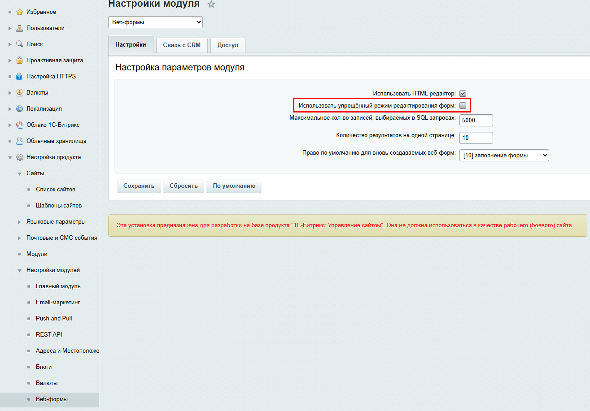
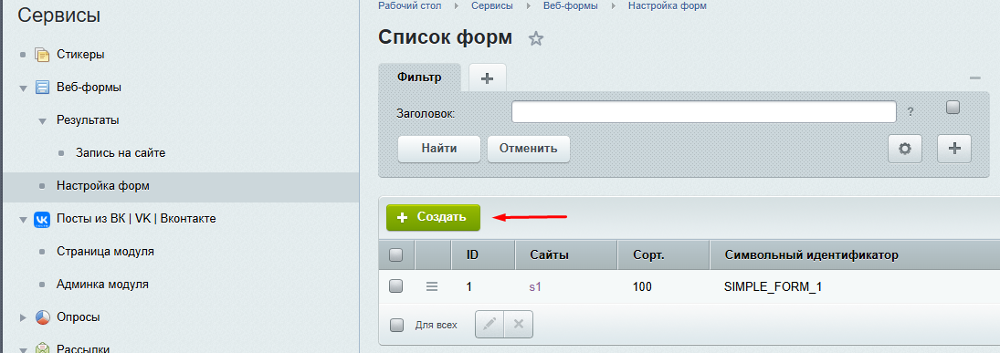
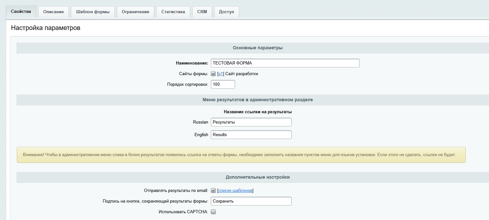
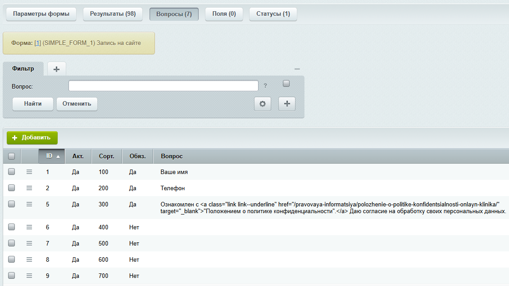

# 1. Стандартный компонент веб-формы с AJAX и Yandex smartcaptcha
## Что получим на выходе:
+ Шаблон формы с собственным контроллером внутри
+ Класс для реализации невидимого виджета смарткапчи в ajax-запросах
+ Валидацию и обработчик ошибок формы

Перед созданием формы лучше отключить в настройках модуля "Веб-формы" упрощенный режим

## Создание и настройка формы

Для начала нам необходимо создать форму в административном разделе.  
 

После заполнения полей форму нужно сохранить и настроить поля, которые будут показаны в компоненте 
и подключить сам компонент на страницу.

```php
$APPLICATION->IncludeComponent(
                    "bitrix:form.result.new",
                    "feedback",
                    [
                        "WEB_FORM_ID" => "1",
                        "IGNORE_CUSTOM_TEMPLATE" => "N",
                        "USE_EXTENDED_ERRORS" => "N",
                        "SEF_MODE" => "N",
                        "VARIABLE_ALIASES_WEB_FORM_ID" => "WEB_FORM_ID",
                        "VARIABLE_ALIASES_RESULT_ID" => "RESULT_ID",
                        "SEF_FOLDER" => "",
                        "CACHE_TYPE" => "A",
                        "CACHE_TIME" => "3600",
                        "CACHE_NOTES" => "",
                        "LIST_URL" => "result_list.php",
                        "EDIT_URL" => "result_edit.php",
                        "SUCCESS_URL" => "",
                        "CHAIN_ITEM_TEXT" => "",
                        "CHAIN_ITEM_LINK" => ""
                    ],
                    false
                );
```

## AJAX обработка

Для отправки данных будем использовать контроллер в шаблоне компонента, на который будем ссылаться с помощью 
```php
$templateFolder - динамическая переменная, которая хранит в себе путь до текущего шаблона компонента.
```
Сам контроллер: 
```php
require $_SERVER['DOCUMENT_ROOT'] . '/bitrix/modules/main/include/prolog_before.php';

CModule::IncludeModule("form");
CModule::IncludeModule("main");

if (check_bitrix_sessid()) {

    // ===== ПРОВЕРКА ЯНДЕКС КАПЧИ =====
    $smartCaptchaValid = false;
    $smartCaptchaError = '';

    $ip = $_SERVER['REMOTE_ADDR'];
    $url = 'https://smartcaptcha.yandexcloud.net/validate';
    $secret_key = "<SERVER_KEY от яндекса>";
    $user_token = $_REQUEST['smart-token'] ?? '';

    // Проверяем только если токен передан
    if (!empty($user_token)) {
        $data = [
            'secret' => $secret_key,
            'token' => $user_token,
            'ip' => $ip
        ];

        $options = [
            'http' => [
                'header' => "Content-type: application/x-www-form-urlencoded\r\n",
                'method' => 'POST',
                'content' => http_build_query($data),
                'timeout' => 10
            ]
        ];

        try {
            // Отправляем запрос на валидацию капчи
            $context = stream_context_create($options);
            $response = file_get_contents($url, false, $context);
            $response_data = json_decode($response, true);

            if ($response_data && $response_data["status"] === "ok") {
                $smartCaptchaValid = true;
            } else {
                $error_msg = $response_data["message"] ?? "Неизвестная ошибка капчи";
                $smartCaptchaError = "Ошибка капчи: " . $error_msg;
            }
        } catch (Exception $e) {
            $smartCaptchaError = "Ошибка проверки капчи: " . $e->getMessage();
        }
    } else {
        $smartCaptchaError = "Капча не пройдена";
    }

    // Если капча не пройдена - возвращаем ошибку
    if (!$smartCaptchaValid) {
        echo json_encode([
            'success' => false,
            'errors' => ['smartcaptcha' => $smartCaptchaError]
        ]);
        require $_SERVER['DOCUMENT_ROOT'] . '/bitrix/modules/main/include/epilog_after.php';
        exit();
    }

    // ===== ПРОВЕРКА ФОРМЫ BITRIX =====
    $formErrors = CForm::Check($_POST['WEB_FORM_ID'], $_REQUEST, false, "Y", 'Y');

    // Если есть ошибки формы - возвращаем их
    if (count($formErrors)) {
        echo json_encode(['success' => false, 'errors' => $formErrors]);
    } 
    // Если ошибок нет - сохраняем результат
    elseif ($RESULT_ID = CFormResult::Add($_POST['WEB_FORM_ID'], $_REQUEST)) {

        // ===== ПОДГОТОВКА ДАННЫХ ДЛЯ ПИСЬМА =====
        
        // Получаем информацию о форме
        $rsForm = CForm::GetByID($_POST['WEB_FORM_ID']);
        if ($arForm = $rsForm->Fetch()) {
            $FORM_NAME = $arForm["NAME"];
            $FORM_SID = $arForm["SID"];
        } else {
            $FORM_NAME = "Неизвестная форма";
            $FORM_SID = "UNKNOWN";
        }

        // Получаем данные результата формы
        $arAnswer = array();
        CFormResult::GetDataByID($RESULT_ID, array(), $arFields, $arAnswer);

        // Формируем поля для почтового события
        $arEventFields = array();
        $arEventFields["FORM_NAME"] = $FORM_NAME;
        $arEventFields["FORM_SID"] = $FORM_SID;
        $arEventFields["RESULT_ID"] = $RESULT_ID;
        $arEventFields["DATE_CREATE"] = date("d.m.Y H:i:s");
        $arEventFields["SITE_NAME"] = $_SERVER['SERVER_NAME'];

        // Добавляем поля формы в данные для письма
        foreach ($arAnswer as $FIELD_SID => $arField) {
            $value = '';
            foreach ($arField as $fieldData) {
                if (!empty($fieldData["USER_TEXT"])) {
                    $value = $fieldData["USER_TEXT"];
                } elseif (!empty($fieldData["ANSWER_VALUE"])) {
                    $value = $fieldData["ANSWER_VALUE"];
                } elseif (!empty($fieldData["VALUE"])) {
                    $value = $fieldData["VALUE"];
                }
            }

            if (!empty($value)) {
                $arEventFields[$FIELD_SID] = $value;
                $arEventFields[strtoupper($FIELD_SID)] = $value;
            }
        }

        // ===== ОТПРАВКА ПИСЬМА =====
        
        // Определяем какое почтовое событие использовать
        $eventNames = [
            "FORM_FILLING_" . $FORM_SID,
            "WEB_FORM_" . $_POST['WEB_FORM_ID'],
            "FORM_FILLING",
            "NEW_FORM_FILLING"
        ];

        $selectedEvent = null;
        foreach ($eventNames as $eventName) {
            $eventMessage = CEventMessage::GetList($by = "id", $order = "desc",
                array("EVENT_NAME" => $eventName, "ACTIVE" => "Y"));
            if ($eventMessage->Fetch()) {
                $selectedEvent = $eventName;
                break;
            }
        }

        if (!$selectedEvent) {
            $selectedEvent = "FORM_FILLING";
        }

        // Отправляем почтовое событие
        CEvent::Send($selectedEvent, SITE_ID, $arEventFields);

        // Интеграция с CRM (если есть) и установка событий
        CFormCRM::onResultAdded($_POST['WEB_FORM_ID'], $RESULT_ID);
        CFormResult::SetEvent($RESULT_ID);

        echo json_encode(['success' => true, 'errors' => []]);
    } else {
        echo json_encode(['success' => false, 'errors' => $GLOBALS["strError"]]);
    }
} else {
    // Ошибка проверки сессии
    echo json_encode(['success' => false, 'errors' => ['sessid' => 'Не верная сессия. Попробуйте обновить страницу']]);
}

require $_SERVER['DOCUMENT_ROOT'] . '/bitrix/modules/main/include/epilog_after.php';
```

Отправлять форму будем через js. Так как отрисовка объекта формы происходит через переменную
```php 
$arResult["FORM_HEADER"] 
```
нам необходимо задать обертку для нашей формы, через которую будем обращаться к форме по селектору и сможем присвоить свой класс:
```html 
<div class="js-feedback__form"><-ПОДКЛЮЧЕНИЕ_КОМПОНЕНТА_ФОРМЫ-></div>
```
```javascript
const form = document.querySelector(".js-feedback-form form")
form?.classList.add("home-form__form")
```
В проекте подключены файлы smartcaptcha.js - класс для управления капчей и validateForms.js - валидатор для отображения ошибок полей формы. 
Обработка отправки формы:
```javascript
document.addEventListener("DOMContentLoaded", function () {
    const form = document.querySelector(".js-feedback-form form")
    form?.classList.add("home-form__form")

    document.querySelectorAll(".home-form__form input").forEach(e => {
        if (e.type !== "checkbox") {
            e.addEventListener("input", () => {
                e.classList.remove("error")
            })
        } else {
            e.addEventListener("change", () => {
                document.querySelector(".home-form__form .form__checkbox-text").classList.remove("error")
            })
        }
    })
// В класс капчи передаем класс контейнера <div id="smartcaptcha-feedback-form"></div>, который находится в template.php
// Ключ, который нам предоставил Яндекс и DOM - элемент формы
    const homeCaptcha = new SmartCaptcha("smartcaptcha-feedback-form", '<SITE_KEY от яндекса>', form);

    new FormValidator(
        document.querySelector(".home-form__form .feedback_form_name"),
        document.querySelector(".home-form__form .feedback_form_phone"),
        document.querySelector(".home-form__form .form__checkbox-input"),
        document.querySelector('.js-home-form-accept')
    );

    // Метод отправки формы. 1 аргумент - класс формы, 2 - ссылка на контроллер, класс для использования капчи
    ajaxFeedbackForm(document.querySelector('.home-form__form'), formAction, homeCaptcha)
})

let isFeedbackProcessing = false;

function showFeedbackPreloader() {
    document.querySelector(".js-home-form-accept").classList.add("disabled")
    isFeedbackProcessing = true;
}

function hideFeedbackPreloader() {
    document.querySelector(".js-home-form-accept").classList.remove("disabled")
    isFeedbackProcessing = false;
}

function ajaxFeedbackForm(obForm, link, captcha) {
    BX.bind(obForm, 'submit', BX.proxy(function(e) {
        BX.PreventDefault(e);

        console.log(obForm)

        if (isFeedbackProcessing) {
            console.log("Форма уже отправляется, подождите...");
            return false;
        }
        
        // Проверяем чекбокс
        const agreeCheckbox = document.querySelector(".home-form__form .form__checkbox-input");
        if (!agreeCheckbox.checked) {
            document.querySelector(".home-form__form .form__checkbox-text").classList.add("error");
            console.log("Чекбокс согласия не отмечен");
            return false;
        }

        captcha.reset();
        captcha.render();

        console.log('Выполняем капчу...');
        showFeedbackPreloader();

        captcha.callback = function(token) {
            console.log('Токен получен, отправляем форму');
            sendFeedbackFormRequest(obForm, link, captcha, token);
        };

        captcha.execute();

    }, obForm, link));
}

function sendFeedbackFormRequest(obForm, link, captcha, token) {
    let xhr = new XMLHttpRequest();
    xhr.open('POST', link);

    xhr.onload = function () {
        hideFeedbackPreloader();

        if (xhr.status != 200) {
            alert(`Ошибка ${xhr.status}: ${xhr.statusText}`);
            captcha.reset();
        } else {
            var json = JSON.parse(xhr.responseText)
            if (!json.success) {
                console.log(json.errors)
                if (json.errors.NAME) {
                    document.querySelector(".home-form__form .feedback_form_name").classList.add("error")
                }
                if (json.errors.PHONE) {
                    document.querySelector(".home-form__form .feedback_form_phone").classList.add("error")
                    // Показываем нашу кастомную ошибку валидации
                    validatePhone('.home-form__form .input-phone');
                }
                if (json.errors.AGREE) {
                    document.querySelector(".home-form__form .form__checkbox-text").classList.add("error")
                }
                if (json.errors.smartcaptcha) {
                    console.log('Ошибка капчи:', json.errors.smartcaptcha);
                    // При ошибке капчи сбрасываем и перезапускаем
                    setTimeout(() => {
                        captcha.reset();
                        captcha.execute();
                    }, 1000);
                }
            } else {
                new GraphModal().open('form-success');
                obForm.reset();
                setTimeout(() => captcha.reset(), 1000);
            }
        }
    };

    xhr.onerror = function () {
        hideFeedbackPreloader();
        alert("Запрос не удался");
        captcha.reset();
    };

    xhr.onabort = function () {
        hideFeedbackPreloader();
        captcha.reset();
    };

    // Добавляем токен капчи к данным формы
    const formData = new FormData(obForm);
    if (token) {
        formData.append('smart-token', token);
        console.log('Добавлен токен:', token);
    }
    xhr.send(formData);
}
```


